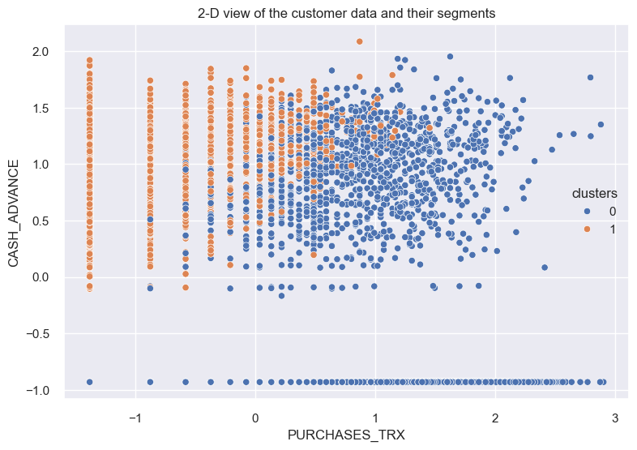

# Credit Card Risk Prediction System

## Abstract
Anticipating credit card risk is crucial for businesses to prevent losses and optimize marketing approaches. Given the inherent financial uncertainties tied to credit card usage, the need for robust risk prediction models becomes evident. This study aimed to create a predictive system categorizing customers by risk level, enabling businesses to target low-risk customers and minimize potential losses.
The methodology involved using an unsupervised clustering technique to label an unlabeled dataset, followed by visualization methods for label interpretation. Subsequently, a supervised learning model, specifically a fine-tuned Support Vector Machine (SVM), was employed. The resulting model demonstrated commendable performance, achieving 0.971 accuracy and F1 score on unseen data.
This methodology produced a highly accurate predictive model, empowering businesses to make informed decisions, proactively manage credit card risks, and potentially enhance market strategies while averting financial setbacks.

## Background and Problem Description
The unpredictable nature of financial outcomes in credit card transactions poses a significant challenge for businesses. This study addresses the need for robust risk prediction models to navigate uncertainties, avert potential losses, and refine marketing strategies.

## Approach
### Data preparation
The dataset was found to contain 8950 entries and there were some NULL values in the CREDIT LIMIT and MINIMUM PAYMENTS columns. These NULL values were filled using the mean of the columns. In addition to this, the dataset was scaled appropriately for the supervised and unsupervised learning process.

### Exploratory Data Analysis
The description of the data was obtained and the distribution of the data across the TENURE column which was categorical with only 7 unique values was obtained. I was found that most of the dataset was for customers with a TENURE category of 12 (the unit was not stated in the dataset). The dataset was also found to contain some outliers which were not handled at the risk of losing majority of the data. The distribution of the data was also obtained for each of the columns, and it was found that most of the features were positively skewed.

### Unsupervised Model Building
As was mentioned initially, it was observed that there was a positive skew in most of the columns in the dataset and this was anticipated to result in visualizations that would be aggregated at one side of a 2D plot. Therefore, the log transform of these columns were obtained instead for clustering purposes[5]. In addition
to this, the data was scaled using a standard scaler to make sure the inconsistencies in the range of the feature values across columns was handled.

### Supervised Model Building
A support Vector Classifier algorithm was selected for building the customer segment prediction model. It was used because it works well in high-dimensional spaces, making it suitable for problems with many features like this one. SVCs can also handle non-linear decision boundaries by using different kernel functions, allowing them to capture complex relationships in the data[6]. A random forest model was used to select the most important features, and this was used to build another SVC model that had very close result with just 6 features compared with using the entire 18 features in the dataset.

### Model debugging
Learning curves were obtained for the SVC classifier to determine if it was overfitting when trained on the entire dataset.

### Model deployment
Flask web framework was used to deploy the model together with the scaler that was used to scale the 6 selected features. Predictions were obtained using the model.

## Results and Discussion
### EDA Results
#### Distribution of dataset across tenures.

### Clustering Model Results
#### Elbow Curve and Silhouette Score for optimal cluster determination.

    
    

#### 2D visualization of clustered data after PCA.

    
    

### Supervised Model Results

#### Learning Curve

#### Model Performance

| S/N | MODEL DESCRIPTION                | F1 SCORE PERFORMANCE |
| --- | --------------------------------| -------------------- |
| 1   | SVC model trained on all features | 0.970               |
| 2   | SVC model trained on selected features | 0.966           |
| 3   | Tuning result of the selected benchmark | 0.971           |

## Discussion
The silhouette score plot and the Within-Cluster Sum of Squares plot gave similar results in terms of the optimal number of clusters for the clustering model. The clustered data was more visible when the log transforms of the positively skewed columns were obtained. This indicates that log transforms are very effective on skewed data points.
A graph of the advances and the purchases transactions was obtained, and it was observed that High risk customers take more advances and they have the label 1 while low risk customers have label 0.
The SVC model trained on all the features started overfitting at some point as can be observed from the plot above. This was when the training performance plateaued and eventually started decreasing. The model with the selected features had a performance less than the model trained on the 15 features but it was selected because the performance was incredibly close and when the model was tuned, a better performance was obtained from the model on the test set.

## Conclusion
The exploratory data analysis unveiled insights into the distribution of the dataset and the efficacy of log transformations in clustering visualization. The supervised model's learning curve revealed potential overfitting which prompted a strategic feature selection process, resulting in a tuned model with optimal performance on the test set.
In conclusion, this comprehensive approach equips businesses with a powerful tool for credit card risk management. The deployed model, backed by rigorous analysis and tuning, provides a user-friendly solution for predicting customer segments, ultimately enabling informed decision-making and proactive risk mitigation in the ever-evolving landscape of credit transactions.